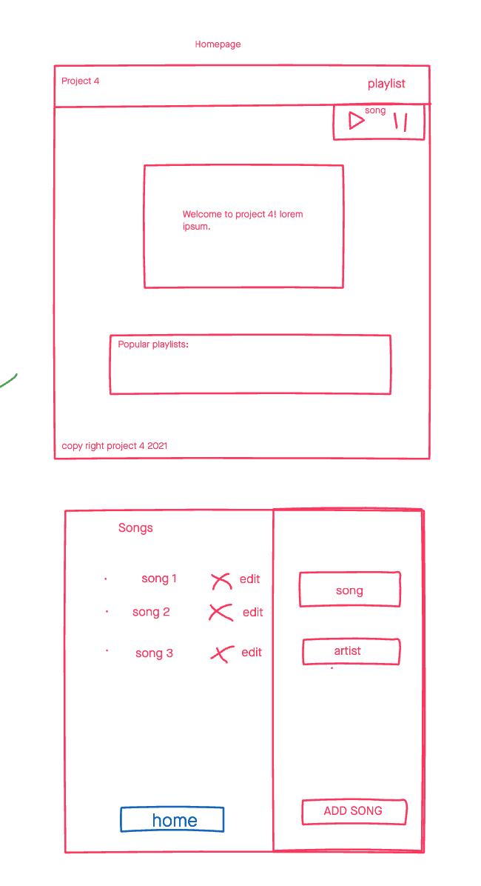
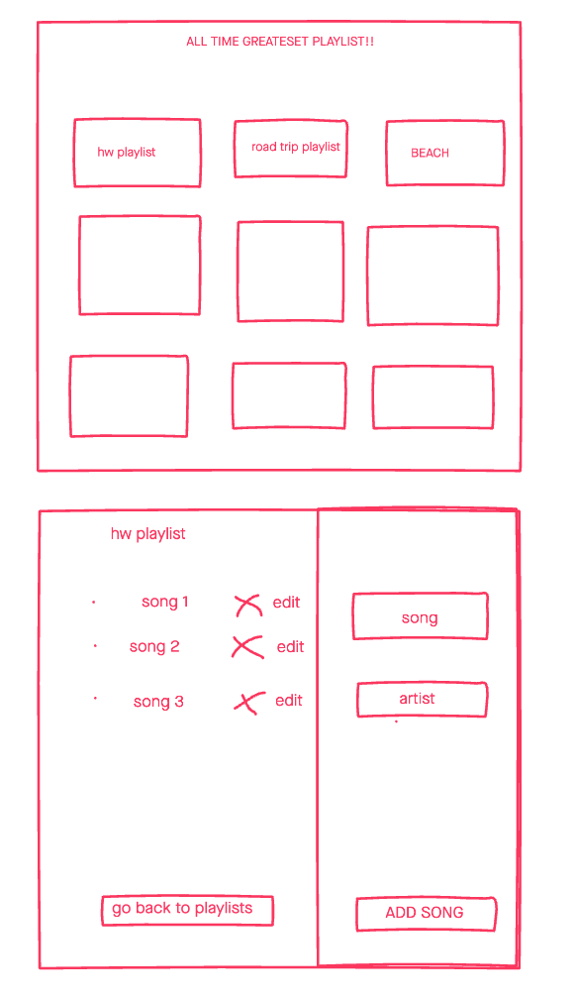
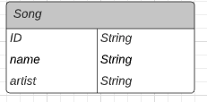

# Project 4 - Tune It Up
 Fourth dev group project! Created by Luis Rosario, Deanna Norman, and Zoë Owens. A simple app that combines a Rails backend with a React front end. A user can use Tune It Up to keep track of and save his, her, or their favorite songs! 

 ## Technologies Used
 - React 
 - Ruby on Rails 
 - CSS3
 - JavaScript
 - Node.js
 - Invision App
 - Trello
 - PostgreSQL
 - Heroku
 - Netlify
 - Github
 - Font Awesome

 ### Wireframe - 1
 

 ### Wireframe - 2
 

 ### ERD:
 

 ### Getting Started:
 Trello Board - https://trello.com/b/fW3Fedaq/project
 Deploy Here - https://tune-it-up.netlify.app/

 ### Future Enhancements:
- Add playlists feature
- Add Authentication
- Add Album Covers
